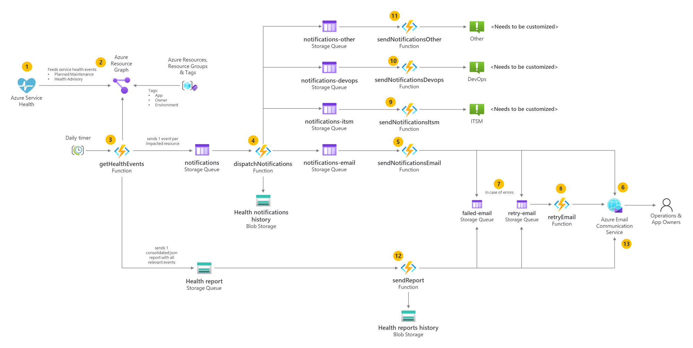

# Service Health Enhanced Notifications

## Introduction

Azure service issues, updates & retirements can occur. Service issues are anything that could affect your availability, from outages and planned maintenance to service transitions and retirements. While rare, they occur. [Azure Service Health](https://learn.microsoft.com/en-us/azure/service-health/overview) is a free Azure service that provides alerts and guidance regarding these occurrences on a timely fashion. In some organizations the challenge is to make these alerts reach out to the right people like the Application Owners. They should be aware of these occurrences to properly plan in advance how to deal with such situations.

Given this context, let's define a Service Health Enhanced Notifications process to ensure that events like Planned maintenance & Service transitions and retirements are communicated in a timely fashion to the right persons

This project aims to enhance notifications triggered by Azure Service Health alerts. Azure Service Health provides personalized alerts and guidance when Azure service issues affect you. It can notify you, help you understand the impact of issues, and keep you updated as the issue is resolved. Although Azure Service Health provides an Alerts feature, in some custom scenarios we need to enhance and further customize the integration with other systems.


## Solution overview

The solution is based on Azure Functions and Azure Storage. The Azure Function is triggered by a Timer and checks new Service Health events on Resource Graph. When a new event is found, the function sends a notification to a storage queue. A second Azure Function is used to send notifications to the Application Owners. The notification can be sent by email, or by calling the APIS of externals systems like ITSM, DevOps or others.



1. Azure Service Health announces "events" affecting specific service types and regions and stores this information on Resource Graph.
2. Alongside service health events information, Resource Graph also stores metadata of each Azure resource, including tags.
3. The Azure Function getHealthEvents queries [Resource Graph](https://learn.microsoft.com/en-us/azure/service-health/resource-graph-samples?tabs=azure-cli#azure-service-health) to collect information regarding service health events and impacted resources. For each resource, tags are used to identify the application and the owner (e.g., "App" and "Owner" tags) to be notified. Each notification is sent to a dispatch Storage Queue. Additionally, a consolidated report with all the relevant events is also generated to blob storage. This entire process is triggered by a daily timer.
4. The sendNotifications function collects each notification event and sends it to the proper destinations (e-mail, ITSM, DevOps or Others). Each notification sent is stored in the Health notifications history blob storage.
5. Email notifications are sent by the Azure Communication Email service to the Application owners.
6. Other notifications can be sent by calling the APIS of external systems like ITSM, DevOps or others. This needs to be customized on a case-by-case basis.
7. The sendReport function collects the consolidated report blob and sends it by email to the operations team. Each report is stored in the Health reports history blob storage.
8. Email reports are sent by the Azure Communication Email service to the Operations team.
9. Both the sendNotifications and the sendReports functions implement an error recovery logic in case they are not able to send emails. Failed e-mails are stored in queues to be processed later.
10. Email messages are picked by the retryEmail function that tries to send them again.


## Step 1. Setup Azure resources

To create Azure resources, you can use the provided `scripts/create-azure-env.sh` file. Copy `template.env` to a new file named `.env` and customize the settings according to your environment.
After this customization, just run the provided file in the `scripts` directory:

```bash
./create-azure-env.sh
```

In the end you should have the following resources created:


## Step 2. Deploy function app to Azure using GitHub Actions

Use the provided GitHub Action workflow file `.github/workflows/azure-deploy.yml` that deploys the Function app in your environment.

### 2.1. Create a Service principal to deploy Function app and configure Secrets in GitHub

Run the provided script `scripts/prep-github-actions.sh` to create a Service Principal. The command should output a JSON object similar to this:

```json
  {
    "clientId": "<GUID>",
    "clientSecret": "<GUID>",
    "subscriptionId": "<GUID>",
    "tenantId": "<GUID>",
    (...)
  }
```
Copy and paste the json response from above Azure CLI to your GitHub Repository > Settings > Secrets > Add a new secret > `AZURE_RBAC_CREDENTIALS`.

### 2.2. Customize GitHub Action

In the GitHub Action workflow file, you can change these variables for your configuration:

| Variable               | Value         | Description                                  |
| ---------------------- | ------------- | -------------------------------------------- |
| AZURE_FUNCTIONAPP_NAME | your-app-name | Set this to your function app name on Azure. |


### 2.3. Commit and push your project to GitHub repository

You should see a new GitHub workflow initiated in Actions tab.


## Step 3. Assign roles and permissions to Function app

Function app system assigned identity needs to have the following roles to be able to execute certain operations in other Azure resources. If you use the provided script `scripts\create-azure-env.sh` these roles are already assigned:

| Role                           | Azure resource               | Notes |
| ------------------------------ | ---------------------------- | ----- |
| Storage Blob Data Owner        | Storage Account              | For blobs |
| Storage Queue Data Contributor | Storage Account              | For queues |
| Key Vault Secrets User         | Key Vault                    | To get secrets |
| Contributor or Custom Role     | Communications Service       | To send emails. Check **Notes** below. |
| Reader                         | All Azure resources, Subscription level or Management Group level | Access to all the resources for which we want to be notified about any service health event. To use Resource Graph, you must have appropriate rights in Azure role-based access control (Azure RBAC) with at least read access to the resources you want to query. No results are returned if you don't have at least read permissions to the Azure object or object group. |


### Notes
According to the [documentation](https://learn.microsoft.com/en-us/azure/communication-services/quickstarts/email/send-email-smtp/smtp-authentication#using-a-microsoft-entra-application-with-access-to-the-azure-communication-services-resource-for-smtp) you need to assign the Function app identity the following permissions on the Azure Communication Service Resource to be able to send emails:
- Microsoft.Communication/CommunicationServices/Read
- Microsoft.Communication/CommunicationServices/Write
- Microsoft.Communication/EmailServices/write

You can create a custom role with these permissions and assign it to the Function app identity or you can just assign the Contributor role to the Function app identity. If you prefer to create a custom role you can use the provided script `scripts/create-custom-role.sh`. Before running this script, edit the json file `scripts/custom-email-send-role.json` and change the subscription scope.


## Step 4. Configure Key Vault settings

You need to add these secrets in your Key Vault:

| Secret name                             | Value                                                         | Description |
| --------------------------------------- | ------------------------------------------------------------- | ----------- |
| servicehealth-email-endpoint            | https://xpto.communication.azure.com                          | The endpoint of your Communications service. |
| servicehealth-email-sender-address      | donotreply@11111111-0000-2222-3333-111111111111.azurecomm.net | The email address of the sender for all emails. |
| servicehealth-email-test-only-recipient | xpto@contoso.com                                              | The email address for testing. |

You need to have the `Key Vault Secrets Officer` role to add these secrets. You can use the provided script `scripts/add-keyvault-secrets.sh` to add these secrets to your Key Vault.


## Step 5. Configure Function App environment settings

Adjust these settings in your Function app environment:

| Key                       | Value                                         | Description                                   |
| ------------------------- | --------------------------------------------- | ------------------------------------------------------ |
| AzureWebJobsStorage       | Storage Account connection string       | Used by the Function App to store data and use queues.       |
| EMAIL_SEND                | `true` or `false`                     | Depending if you want to send email notifications or not.
| EMAIL_ENDPOINT            | @Microsoft.KeyVault(VaultName=your_key_vault_name;SecretName=servicehealth-email-endpoint) | Points to the corresponding Key vault secret. Replace `your_key_vault_name` with your own. |
| EMAIL_SENDER_ADDRESS      | @Microsoft.KeyVault(VaultName=your_key_vault_name;SecretName=servicehealth-email-sender-address) | Points to the corresponding Key vault secret. Replace `your_key_vault_name` with your own. |
| EMAIL_TEST_ONLY_RECIPIENT | @Microsoft.KeyVault(VaultName=your_key_vault_name;SecretName=servicehealth-email-test-only-recipient) | Points to the corresponding Key vault secret. Replace `your_key_vault_name` with your own. |

You can go directly to Azure Portal, or you can use Azure CLI to set these settings:

```bash
# Example
az functionapp config appsettings set --name <function-app-name> --resource-group <resource-group-name> --settings EMAIL_SEND=true
```

## Development

You can check the guidelines for development in the [DEVELOPMENT](docs/development.md) file.
