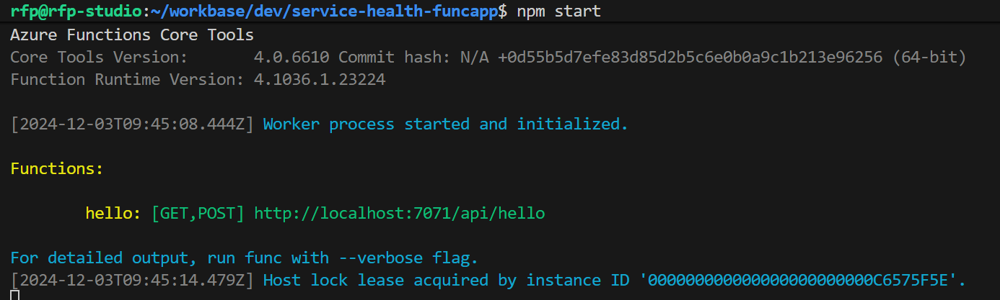

# Service Health Enhanced Notifications

## Introduction

Azure service issues, updates & retirements can occur. Service issues are anything that could affect your availability, from outages and planned maintenance to service transitions and retirements. While rare, they occur. [Azure Service Health](https://learn.microsoft.com/en-us/azure/service-health/overview) is a free Azure service that provides alerts and guidance regarding these occurrences on a timely fashion. In some organizations the challenge is to make these alerts reach out to the right persons like the Application Owners. They should be aware of these occurrences to properly plan in advance how to deal with such situations.

Given this context, let's define a Service Health Enhanced Notifications process to ensure that events like Planned maintenance & Service transitions and retirements are communicated in a timely fashion to the right persons

This project aims to enhance notifications triggered by Azure Service Health alerts. Azure Service Health provides personalized alerts and guidance when Azure service issues affect you. It can notify you, help you understand the impact of issues, and keep you updated as the issue is resolved. Although Azure Service Health provides an Alerts feature, in some custom scenarios we need to enhance and further customize the integration with other systems.


## Solution overview

The solution is based on Azure Functions and Azure Storage. The Azure Function is triggered by a Timer and checks new Service Health events on Resource Graph. When a new event is found, the function sends a notification to a storage queue. A second Azure Function is used to send notifications to the Application Owners. The notification can be sent by email, ot by calling the APIS of externals systems like ITSM, DevOps or others. The Azure Function stores the last event processed in Azure Storage to avoid sending duplicate notifications. On a montlhy basis the resend Azure Function checks for active notifications and resends them.


1. Azure Service Health announces "events" affecting specific service types and regions and stores this information on Resource Graph.
2. Alongside service health events information, Resource Graph also stores metadata of each Azure resource, including tags.
3. The Service Health Enhanced Notifications  processing engine is implemented as an Azure Function that queries [Resource Graph](https://learn.microsoft.com/en-us/azure/service-health/resource-graph-samples?tabs=azure-cli#azure-service-health) to collect information regarding service health events and impacted resources. For each resource, tags are used to identify the application ("Lac" tag) and the owner ("Owner" tag) to be notified. Each notification is sent to a dispatch Storage Queue. This process is triggered by a daily timer.
4. The sendNotifications function collects each notification event and sends it to the proper destinations (e-mail, ITSM, DevOps or Others). Each notification sent is stored in the Active Notifications history blob storage.
5. Since most of the notifications are related with future events, until the event happens, a repeated notification for the same event will be sent once a month (to ensure that it’s not forgotten). To support this, we have a scheduled Azure Function that reads the Active Notifications repository containing notifications that didn’t expire yet (residing on Storage Tables).


## Setup

Configure your local environment and install Azure Function Core tools following the instructions in the [Azure Functions Core Tools](https://learn.microsoft.com/en-us/azure/azure-functions/create-first-function-cli-typescript?tabs=linux%2Cazure-cli%2Cbrowser&pivots=nodejs-model-v4) documentation.

### Setup Azure resources

To create Azure resources you can use the provided `scripts/create-azure-env.sh` file. Copy `template.env` to a new file named `.env` and customize the settings according to your environment.
After this customization, just run the provided file in the `scripts` directory:

```bash
./create-azure-env.sh
```

In the end you should have the following resources created:


### Create a local functions project

```bash
func init --typescript

# Add a function to your project 
func new --name hello --template "HTTP trigger" --authlevel "anonymous"

# Add a function to your project 
func new --name collectHealth --template "Timer trigger" --authlevel "anonymous"
```

Add Azure Storage connection information in `local.settings.json` and adjust the settings of your Storage account:

```json
{
  "IsEncrypted": false,
  "Values": {
    "FUNCTIONS_WORKER_RUNTIME": "node",
    "AzureWebJobsStorage": "DefaultEndpointsProtocol=https;AccountName=your_storage_account_name;AccountKey=your_storage_account_key;EndpointSuffix=core.windows.net"
  }
}
```

Run the function locally

```bash
npm start
```



Send a request to the function

```bash
# Test timer trigger locally
curl --request POST -H "Content-Type:application/json" -H "x-functions-key:xxxxxxxxxxxxx" --data '{"input":""}'  http://localhost:7071/admin/functions/getHealthEvents

# Test timer trigger remotelly
curl --request POST -H "Content-Type:application/json" -H "x-functions-key:xxxxxxxxxxxxx" --data '{"input":""}'  https://xpto.azurewebsites.net/admin/functions/getHealthEvents

# Test othet http functions locally
curl --request POST -H "Content-Type:application/json" -H "x-functions-key:xxxxxxxxxxxxx" --data '{"input":""}'  http://localhost:7071/api/hello
```

## Deploy function app to Azure


### Deploy manually
```bash
npm run prestart
func azure functionapp publish <the name of your function app Azure resource>
```

### Deploy using GitHub Actions

You can use the provided GitHub Action workflow file `.github/workflows/azure-deploy.yml` that deploys the Function app in your environment.

**Step 1.** Create a Service principal to deploy Function app and configure Secrets in GitHub

Run the provided script `scripts/prep-github-actions.sh` to create a Service Principal. The command should output a JSON object similar to this:

```json
  {
    "clientId": "<GUID>",
    "clientSecret": "<GUID>",
    "subscriptionId": "<GUID>",
    "tenantId": "<GUID>",
    (...)
  }
```
Copy and paste the json response from above Azure CLI to your GitHub Repository > Settings > Secrets > Add a new secret > `AZURE_RBAC_CREDENTIALS`.

**Step 2.** In the GitHub Action workflow file you can change these variables for your configuration:

| Variable               | Value         | Description                                  |
| ---------------------- | ------------- | -------------------------------------------- |
| AZURE_FUNCTIONAPP_NAME | your-app-name | Set this to your function app name on Azure. |

**Step 3.** Commit and push your project to GitHub repository, you should see a new GitHub workflow initiated in Actions tab.


## Function App system assigned identity required roles

Function app system assigned identity needs to have the following roles in order to be able to execute certain operations in other Azure resources. If you use the provided script `scripts\create-azure-env.sh` these roles are already assigned:

| Role                           | Azure resource               |
| ------------------------------ | ---------------------------- |
| Storage Blob Data Owner        | Storage Account              |
| Storage Queue Data Contributor | Storage Account              |
| Key Vault Secrets User         | Key Vault                    |
| Contributor or Custom Role     | Communications Service       |

According to the [documentation](https://learn.microsoft.com/en-us/azure/communication-services/quickstarts/email/send-email-smtp/smtp-authentication#using-a-microsoft-entra-application-with-access-to-the-azure-communication-services-resource-for-smtp) you need to assign the Function app identity the following permissions on the Azure Communication Service Resource to be able to send emails:
- Microsoft.Communication/CommunicationServices/Read
- Microsoft.Communication/CommunicationServices/Write
- Microsoft.Communication/EmailServices/write

You can create a custom role with these permissions and assign it to the Function app identity or you can just assign the Contributor role to the Function app identity. If you prefer to create a cuistpom role you can use the provided script `scripts/create-custom-role.sh`. Before runnning this script, edit the json file `scripts/custom-email-send-role.json` and change the subscription scope.


## Function App environment settings

Adjust these settings in your Function app environment:

| Key                 | Value                                         |
| ------------------- | --------------------------------------------- |
| AzureWebJobsStorage | Storage Account connection string used.       |
| KEYVAULT_URI        | The URI of your Key Vault. You can get this URI from the Azure Portal. |
| OUTPUT_SEND_MAIL    | true or false if you want to send out emails. |


You can go directly to Azure Portal or you can use Azure CLI to set these settings:

```bash
# Example
az functionapp config appsettings set --name <function-app-name> --resource-group <resource-group-name> --settings OUTPUT_SEND_MAIL=true
```


## Key Vault settings

You need to add these secrets in your Key Vault:

| Secret name                             | Value                                                         | Description |
| --------------------------------------- | ------------------------------------------------------------- | ----------- |
| servicehealth-email-endpoint            | https://xpto.communication.azure.com                          | The endpoint of you Communications service. |
| servicehealth-email-sender-address      | donotreply@11111111-0000-2222-3333-111111111111.azurecomm.net | The email address of the sender for all emails. |
| servicehealth-email-test-only-recipient | xpto@contoso.com                                              | The email address for testing. |

You need to have the `Key Vault Secrets Officer` role to add these secrets. You can use the provided script `scripts/add-keyvault-secrets.sh` to add these secrets to your Key Vault.


## TODO

- [ ] Test Azure mail
- [ ] Add more details to the architecture diagram
- [ ] Review readme
