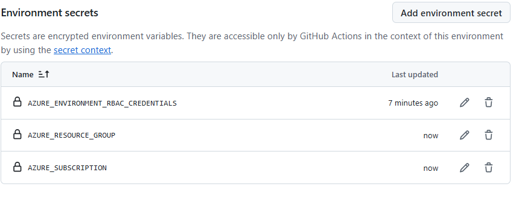
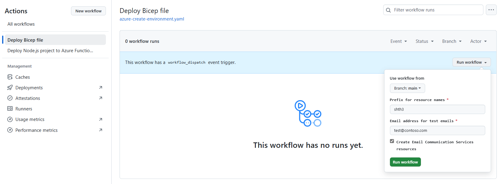
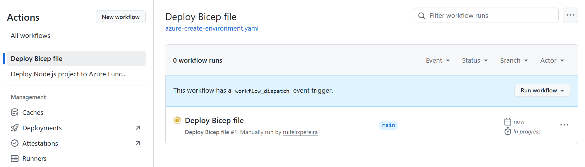
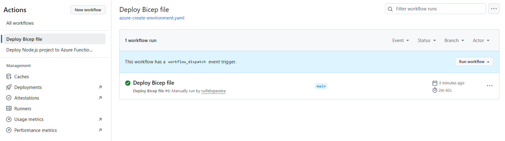

# Create Azure Environment

You have two options to create the required Azure resources, either using the provided az cli based script or using the GitHub Action that runs bicep for you.

## Option 1: Using the provided script

To create Azure resources, you can use the provided `scripts/azure/create-azure-environment.sh` file. Copy `template.env` to a new file named `.env` and customize the settings according to your environment.
After this customization, just run the provided file in the `scripts/azure` directory:

```bash
./create-azure-environment.sh
```

In the end you should have the following resources created:


## Option 2: Using GitHub Actions

You can also create the required Azure resources using the provided GitHub Action workflow. This is especially useful if you want to automate the deployment process or if you prefer not to run scripts locally.
To use this method, follow these steps.

### Step 1. Fork the repository to your GitHub account


### Step 2. Create a Service principal to create Azure resources and configure Secrets in GitHub

Run the provided script `scripts/development/setup-github-actions-create-environment.sh` to create a Service Principal. The command should output a JSON object similar to this:

```json
{
    "clientId": "<GUID>",
    "clientSecret": "<GUID>",
    "subscriptionId": "<GUID>",
    "tenantId": "<GUID>",
    (...)
}
```
Copy and paste the json response from above Azure CLI to your GitHub Repository > Settings > Environments > dev environment > Add environment secret > `AZURE_ENVIRONMENT_RBAC_CREDENTIALS`.

If you environment is not named `dev`, you need to change it in the workflow file `.github/workflows/azure-create-environment.yml` in the line:

```yaml
environment: dev
```

Additionally, you also need to configure the following secrets in your GitHub environment:

| Variable               | Value         | Description                                  |
| ---------------------- | ------------- | -------------------------------------------- |
| AZURE_RESOURCE_GROUP   | Your resource group name | The resource group where the Azure resources will be created. |
| AZURE_SUBSCRIPTION_ID  | Your subscription ID | The subscription ID where the Azure resources will be created. |

In the end you should these secrets defined in your environment:




### Step 3. Run the GitHub Action workflow

Go to the "Actions" tab in your forked repository, navigate to the workflow named "Create Azure Environment" and click on the "Run workflow" button.



Fill in the required parameters:

| Parameter              | Description                                  |
| ---------------------- | -------------------------------------------- |
| prefix                | A prefix/unique id that will be used for the resource naming.  |
| createCommunicationServices | Flag `true` or `false` to indicate whether to create Communication Services resources. |
| emailTestOnlyRecipient | The email address of the recipient of the test emails. |

Click on the "Run workflow" button to start the process.



It should take a couiple of minutes to finish.



After the workflow completes successfully, you should have the required Azure resources created in your specified resource group.


