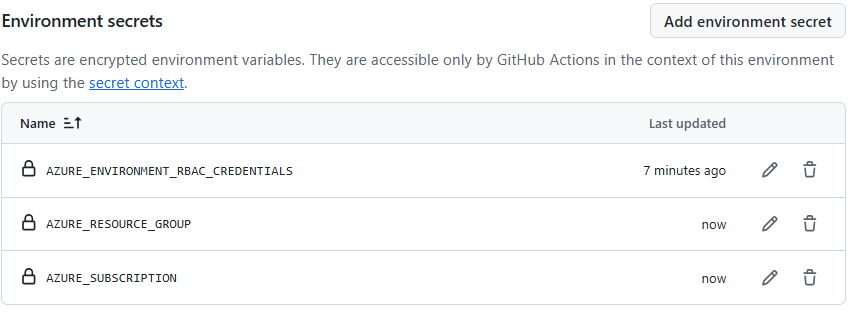

# Development

## Setup local environment

Configure your local environment and install Azure Function Core tools following the instructions in the [Azure Functions Core Tools](https://learn.microsoft.com/en-us/azure/azure-functions/create-first-function-cli-typescript?tabs=linux%2Cazure-cli%2Cbrowser&pivots=nodejs-model-v4) documentation.


## Setup Azure resources

To create Azure resources, you can use the provided `scripts/azure/create-azure-environment.sh` file. Copy `template.env` to a new file named `.env` and customize the settings according to your environment.
After this customization, just run the provided file in the `scripts/azure` directory:

```bash
./create-azure-environment.sh
```

In the end you should have the following resources created:


Additionally, for running the function app locally and access other Azure resources, you need to have a service principal, give the proper role assignements to the service principal and configure it locally in the `local.settings.json` file. The provided script `scripts/development/create-service-principal-local-dev.sh` helps to automate all these steps. Copy `template.env` to a new file named `.env` and customize the settings according to your environment. After this customization, just run the provided file in the `scripts/development` directory:

```bash
./create-service-principal-local-dev.sh
```

Run the `scripts/development/permissions-az-login.sh` script to give permissions to the logged-in user in the newly created storage account (only if you need to browse data).

## Create a local functions project

### Step 1. Create the required assets

```bash
func init --typescript

# Add a function to your project 
func new --name hello --template "HTTP trigger" --authlevel "anonymous"

# Add a function to your project 
func new --name collectHealth --template "Timer trigger" --authlevel "anonymous"
```

### Step 2. Configure local settings

Add Azure Storage connection information in `local.settings.json` and adjust the settings of your Storage account:

```json
{
  "IsEncrypted": false,
  "Values": {
    "FUNCTIONS_WORKER_RUNTIME": "node",
    "AzureWebJobsStorage": "DefaultEndpointsProtocol=https;AccountName=your_storage_account_name;AccountKey=your_storage_account_key;EndpointSuffix=core.windows.net"
  }
}
```

If you used the script `create-service-principal-local-dev`, the `local.settings.json` file should already be configured with the correct values.


## Run the function locally for testing

```bash
npm start
```


## Deploy Function app manually

```bash
npm install
npm run prestart
func azure functionapp publish <the name of your function app Azure resource> --typescript
```


## Send a request to the function

```bash
# Test timer trigger locally
curl --request POST -H "Content-Type:application/json" -H "x-functions-key:xxxxxxxxxxxxx" --data '{"input":""}'  http://localhost:7071/admin/functions/getHealthEvents

# Test timer trigger remotely
curl --request POST -H "Content-Type:application/json" -H "x-functions-key:xxxxxxxxxxxxx" --data '{"input":""}'  https://xpto.azurewebsites.net/admin/functions/getHealthEvents

# Test http functions locally
curl --request POST -H "Content-Type:application/json" -H "x-functions-key:xxxxxxxxxxxxx" --data '{"input":""}'  http://localhost:7071/api/hello
```


## Install Node and Functions Core Tools

These are pre-requisites to run the environment locally:
- [Node version >=20.18.1](https://nodejs.org/en/)
- [Azure Function Core Tools](https://learn.microsoft.com/en-us/azure/azure-functions/functions-run-local?tabs=linux%2Cisolated-process%2Cnode-v4%2Cpython-v2%2Chttp-trigger%2Ccontainer-apps&pivots=programming-language-typescript#install-the-azure-functions-core-tools)

If using Azure Cloud Shell these tools are already installed.

### Upgrade Node version

If required you can upgrade the node version using `nvm`. Follow these steps:

```bash
# Install nvm
curl -o- https://raw.githubusercontent.com/nvm-sh/nvm/v0.39.7/install.sh | bash

# Activate it
export NVM_DIR="$HOME/.nvm"
[ -s "$NVM_DIR/nvm.sh" ] && \. "$NVM_DIR/nvm.sh"

# List available versions
nvm list

# Install desired version
# nvm install --lts
nvm install v20.19.2

# Make it the default one
nvm alias default v20.19.2

# Verifiy installation

node -v
npm -v
```




